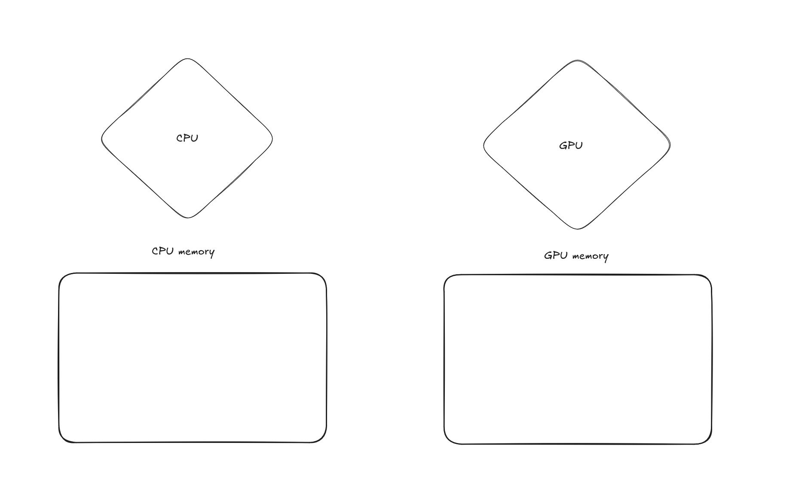
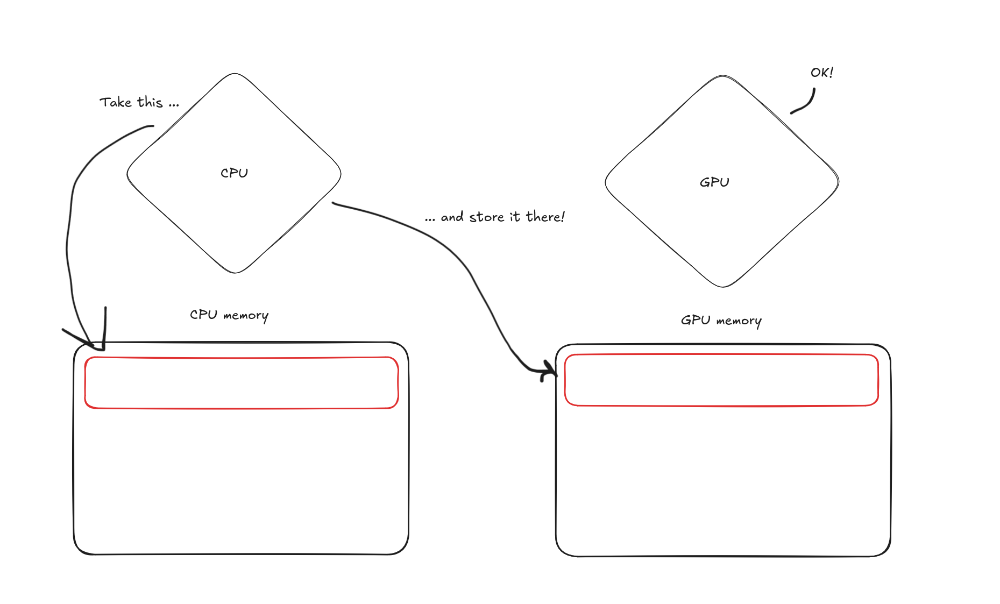
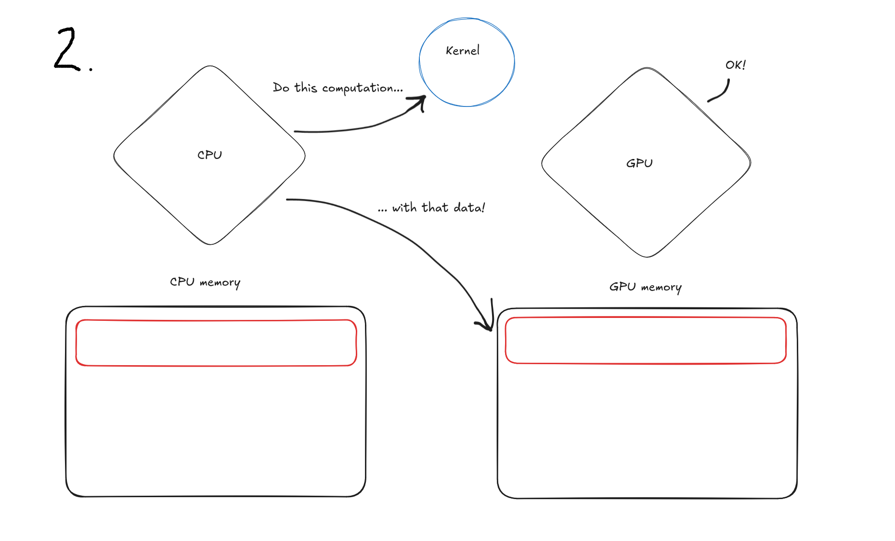
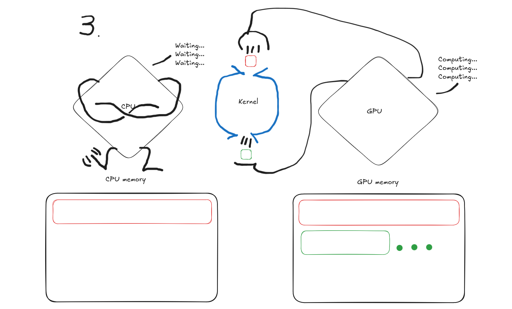
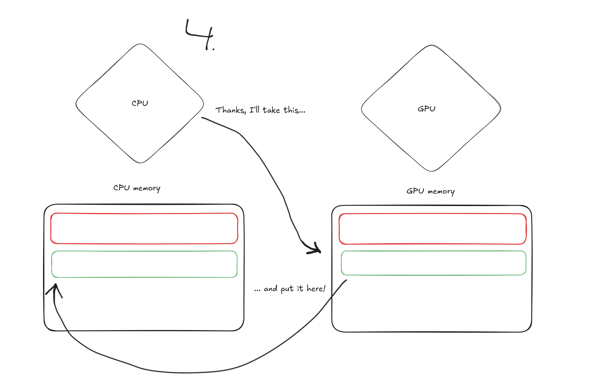

# Overview

We'll be constructing a mental model of a GPU

We'll start simple and slowly add accuracy and complexity

# What is a GPU?

GPU is a processor with a dedicated memory area

{.center width=60%}

::: notes

On the left we have the CPU with it's dedicated memory

On the right we have the GPU with it's dedicated memory

:::

# How do I use the GPU?

To use it, you have to

# How do I use the GPU?

1. Copy memory from CPU to GPU

{.center width=60%}

# How do I use the GPU?

2. Tell the GPU what to do with that data

{.center width=60%}

# How do I use the GPU?

3. Wait for the GPU to finish doing what you told it to do

{.center width=60%}

# How do I use the GPU?

4. Copy memory from GPU back to the CPU

{.center width=60%}

# Why?

But why?

Why move data back and forth from CPU to GPU to CPU?

What's the benefit?

::: notes
This begs the question(s):

What's the point of moving data to the GPU, doing the computation there, then moving it back, instead of just doing the computation locally by the CPU?

Do GPUs run faster that CPUs?

What's the benefit?
:::

# GPUs are massively parallel

::: notes
The answer to the penultimate question is no: GPUs usually have 2-3 times lower clock speeds than CPUs: 1 GHz vs 2-4 GHz.

It makes sense to move data to the GPU and let it do the computation, because, although they run slower, GPUs are massively parallel. GPUs are basically very, very wide SIMD or vector units. Think thousands of lanes wide.
:::

GPUs are basically very very wide SIMD or vector units

{.center width=80%}

# SIMD

::: notes
SIMD stands for Single Instruction, Multiple Data. This is literal: the vector unit performs the same exact instruction (e.g. +) for multiple pieces of data at the same time, i.e. during the same cycle.

So instead of doing c = a + b for a single a and a single b, yielding a singular c, you do it for vectors of values a and b. Then you get a vector of values c. This means thethroughput, i.e. "how many elements you process in a given amount of time", of a vector unit is large.

The concept of a vector unit is not novel, nor is it unique to the GPU. CPUs have vector units as well, but they are narrower than on a GPU.
:::

Element-wise add for arrays `a` and `b` resulting in array `c`

:::::: {.columns}
::: {.column width="50%"}
Scalar version
 \
```cpp

int a[4] = {1, 2, 3, 4};
int b[4] = {5, 6, 7, 8};
int c[4] = {0, 0, 0, 0};

for (int i = 0; i < 4; i++) {
    c[i] = a[i] + b[i];
}
printf("{}", c); // "6, 8, 10, 12"
```
Four cycles, four elements: throughput = 1

:::
::: {.column width="50%"}
SIMD version
 \
```cpp
int a[4] = {1, 2, 3, 4};
int b[4] = {5, 6, 7, 8};
int c[4] = {0, 0, 0, 0};

// A single instruction ("add") performed to
four different elements, during the same cycle.
simd_add(a, b, c);
printf("{}", c); // "6, 8, 10, 12"
```
One cycle, four elements: throughput = 4
:::
::::::

# SIMD

:::::: {.columns}
::: {.column width="50%"}
Scalar version
 \
{.center width=80%}
Four cycles, four elements: throughput = 1

:::
::: {.column width="50%"}
SIMD version
 \
{.center width=80%}
One cycle, four elements: throughput = 4
:::
::::::

# Recap

::: notes
Let's gather our thoughts.

- Moving data from the CPU memory to the GPU memory takes time
- Doing the computation on the GPU takes time
- Finally, moving the data back from the GPU memory to the CPU memory takes time

This is all time that could be spent doing the computation on the CPU.

But we just discovered, that the GPUs are massive parallel units, and thus they can perform the same instruction to multiple pieces of data at the same time.

So which is faster:

1. Doing the computation on the CPU, or
2. Moving data back and forth and using the GPU to do the computation?

A simple answer is: it depends on how much data you have.

Let's take a look at a graph to help us understand this better.
:::

It takes time to

- Move data to the GPU
- Compute on the GPU
- Move results to the CPU

So which is faster:

1. Doing the computation on the CPU, or
2. Moving data back and forth and using the GPU to do the computation?

# Runtimes of Axpy
::: notes
In this graph we have a plot of problem size (horizontal axis) vs runtime (vertical axis).

The legend tells us there are four different versions of the computation:

1. A completely serial computation
2. OpenMP with two threads
3. OpenMP with 64 threads
4. GPU

The serial part runs fastest, if we have less than $10^4$ elements.

Then we see the OpenMP version with 64 threads dominate, if the number of elements is between $10^4$ and $3 \times 10^7$.

Finally, once the problem size is larger than $3 \times 10^7$, the GPU version starts to dominate.

We can also see the GPU and OMP64 versions having a constant runtime, when the number of elements is $< 3 \times 10^7$, even if the problem size increases.

This indicates that the problem is too small to actually use all the available resources: scaling up the problem doesn't cost anything extra, because there are an abundance of free units for doing the work.

Another thing visible is the runtime penalty of using GPUs and multithreaded CPUs:
The runtime difference between the serial version and the other versions is the overhead of using the more parallel versions.

This means it's actually much faster to just do the computation locally, with a single thread, than it is to either spin up a bunch of threads and distribute the problem among them, or copy the data to the massively parallel GPU and let it solve the problem.

Now we are better equipped to understand why and when should we use a GPU and when to do the work locally.

There are many more things to consider, and one should always make informed decisions by measuring the actual performance of the application instead of relying on generic guidelines. But guidelines serve as a starting point.
:::

{.center width=40%}
