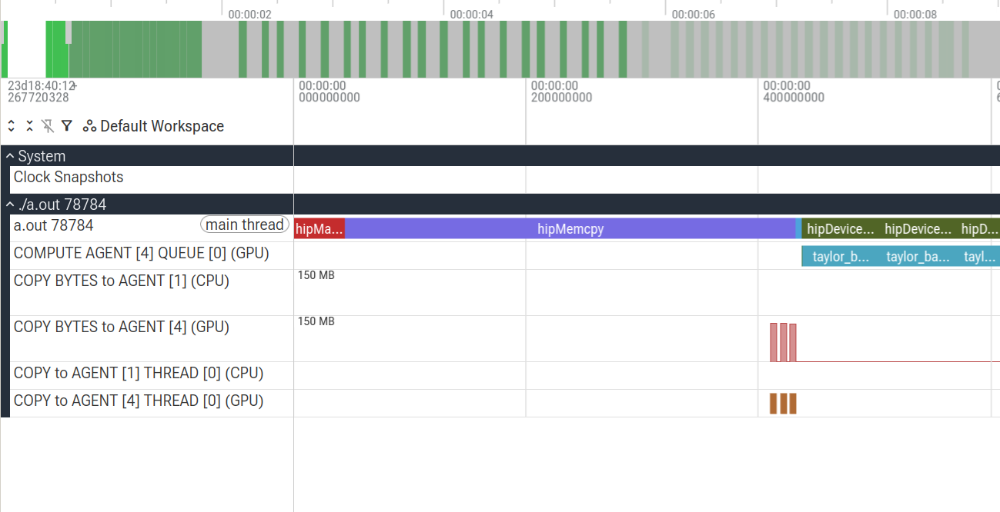
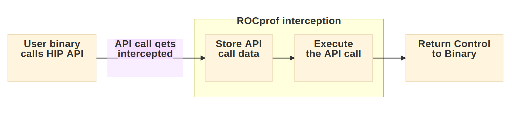

# Collecting a trace with rocprof on LUMI

```bash
srun ... rocprofv3 -r -- ./a.out
```
We get (among others) file `..._kernel_trace.csv`:


```
"Kind","Agent_Id","Queue_Id","Thread_Id","Dispatch_Id","Kernel_Id","Kernel_Name","Correlation_Id","Start_Timestamp","End_Timestamp","Private_Segment_Size","Group_Segment_Size","Workgroup_Size_X","Workgroup_Size_Y","Workgroup_Size_Z","Grid_Size_X","Grid_Size_Y","Grid_Size_Z"
"KERNEL_DISPATCH",4,1,74441,1,2,"__amd_rocclr_initHeap",14,1614963487781917,1614963487791997,0,0,256,1,1,256,1,1
"KERNEL_DISPATCH",4,1,74441,2,18,"taylor_base(float*, float*, unsigned long, unsigned long)",14,1614963488155186,1614963547425378,1024,0,256,1,1,100000000,1,1
"KERNEL_DISPATCH",4,1,74441,3,18,"taylor_base(float*, float*, unsigned long, unsigned long)",27,1614963547688898,1614963607003411,1024,0,256,1,1,100000000,1,1
"KERNEL_DISPATCH",4,1,74441,4,18,"taylor_base(float*, float*, unsigned long, unsigned long)",40,1614963607259568,1614963666422240,1024,0,256,1,1,100000000,1,1
.
.
.
```

- Human readable, sort of.


# Collecting a trace with rocprof on LUMI

```bash
srun ... rocprofv3 -r --output-format perfetto -- ./a.out
```

::::::{.columns}
:::{.column width=30%}
- We get file [`..._results.pftrace`](../demos/rocprofv3-tracing).
- Open it with [perfetto trace analyzer](https://ui.perfetto.dev)
:::
:::{.column}

:::
::::::

:::{.incremental}
- Why?
- Visualize how your program interacts with GPU
:::

# How does it work?

ROCprof wraps HIP API calls with own logic:


:::{.incremental}
- With enough API call data, a timeline of events can be reconstructed
- Sort of **instrumentation** instead of sampling
:::

# What else it can do?

- Collect performance monitoring counters, e.g.:
  - GPU Memory ↔ L2 cache operations 
  - Arithmetic unit utilization
  - Cache misses
  - etc
- Aggregate statistics
- Save traces in other formats (csv, otf2, perfetto, json)
- Record markers in your code (ROCtx)

