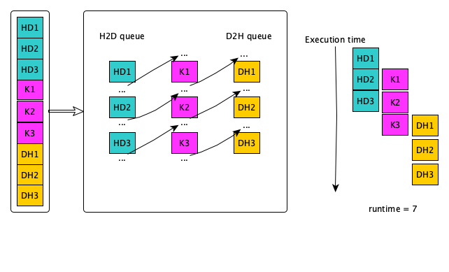
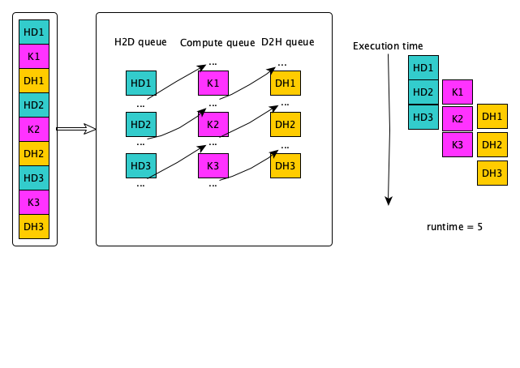

# Streams

* What is a stream?

    * A sequence of operations that execute in issue-order on the GPU
    * HIP operations in different streams could run concurrently
    * The ROCm 4.5.0 brings the  Direct Dispatch, the runtime directly queues a packet to the AQL queue in Dispatch and some of the synchronization. 
    * The previous ROCm uses queue per stream

---

## Concurrency 


---

## Amount of concurrency 


---
## Default

* Only a single stream is used if not defined
* Commands are synchronized except the Async calls and Kernels
    
---

# Example - issue of order (I)

* We have 3 streams and we do 3 (HD, K, DH)


---

# Example - issue of order (II)

* We have 3 streams and we do 3 (HD, K, DH)



* Need to think the dependencies and how to improve the runtime

---
# Synchronization and memory (I)

| HIP API  | Sync Event  | Fence  | Conherent Host Memory Visivility  | Non-Coherent Host Memory Visibility  |
|---|---|---|---|---|
| hipStreamSynchronize  | host waits for all commands in the specified stream to complete  |  system-scope release |  yes | yes  |
|hipDeviceSynchronize   |  host waits for all commands in all streams on the specified device to complete |  system-scope release | yes  |  yes |


---

# Synchronization and memory (II)

| HIP API  | Sync Event  | Fence  | Conherent Host Memory Visivility  | Non-Coherent Host Memory Visibility  |
|---|---|---|---|---|
| hipEventSynchronize  | host waits for the specified event to complete  |  device-scope release |  yes | depends  |
| hipStreanWaitEvent  | stream waits for the specified event to complete  | none  | yes  |  no |

---
# Stream/Events API

* hipStreamCreate: Creates an asynchronous stream
* hipStreamDestroy: Destroy an asynchronous stream
* hipStreamCreateWithFlags: Creates an asynchronous stream with specified flags
* hipEventCreate: Create an event
* hipEventRecord: Record an event in a specified stream
* hipEventSynchronize: Wait for an event to complete
* hipEventElapsedTime: Return the elapsed time between two events
* hipEventDestroy: Destroy the specified event \
HIP API: https://raw.githubusercontent.com/RadeonOpenCompute/ROCm/master/AMD-HIP-API-4.5.pdf
---


# Implicit Synchronization

* himHostMalloc
* hipMalloc
* hipMemcpy
...

---

# Example - Data Transfer and Compute
* Serial
```
  hipCheck( hipEventRecord(startEvent,0) );
  
  hipCheck( hipMemcpy(d_a, a, bytes, hipMemcpyHostToDevice) );
  
  hipLaunchKernelGGL(kernel, n/blockSize, blockSize, 0, 0, d_a, 0);
  
  hipCheck( hipMemcpy(a, d_a, bytes, hipMemcpyDeviceToHost) );
  
  hipCheck( hipEventRecord(stopEvent, 0) );
  hipCheck( hipEventSynchronize(stopEvent) );
  hipCheck( hipEventElapsedTime(&duration, startEvent, stopEvent) );
  printf("Duration of sequential transfer and execute (ms): %f\n", duration);
```

---
# How to improve the performance?

* Use streams to overlap computation with communication
```
hipStream_t stream[nStreams];
for (int i = 0; i < nStreams; ++i)
    hipStreamCreate(&stream[i])
```
* Use Asynchronous data transfer
```
hipMemcpyAsync(dst, src, bytes, hipMemcpy kind, stream)
```
* Execute kernels on different streams
```
hipLaunchKernelGGL((some_kernel, gridsize, blocksize, shared_mem_size, stream, arg0, arg1, ...);
```
---

# Synchronization (I)

* Synchronize everything, could be used after each kernel launch except if you know what you are doing

```
hipDeviceSynchronize()
```
* Synchronize a specific stream
Blocks host until all HIP calls are completed on this stream
```
hipStreamSynchronize(streamid)
```

---

# Synchronization (II)

* Synchronize using Events
    * Create event
    ```
    hipEvent_t stopEvent
    hipEventCreate(&stopEvent)
    ```
    * Record an event in a specific stream and wait until is recorded
    ```
    hipEventRecord(stopEvent,0)
    hipEventSynchronize(stopEvent)
    ```
    * Make a stream wait for a specific event
    ```
    hipStreamWaitEvent(stream[i], stopEvent, unsigned int flags) 	
    ```

---

# Synchronization in a kernel

```
__syncthreads
```

---

