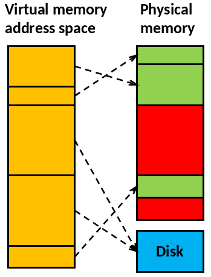
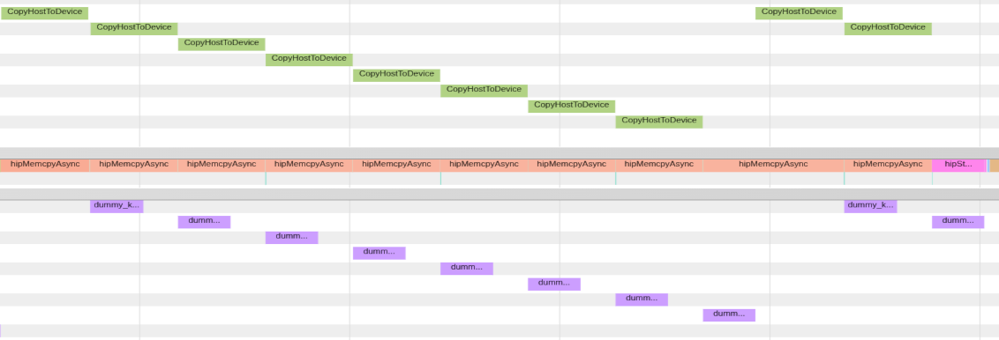
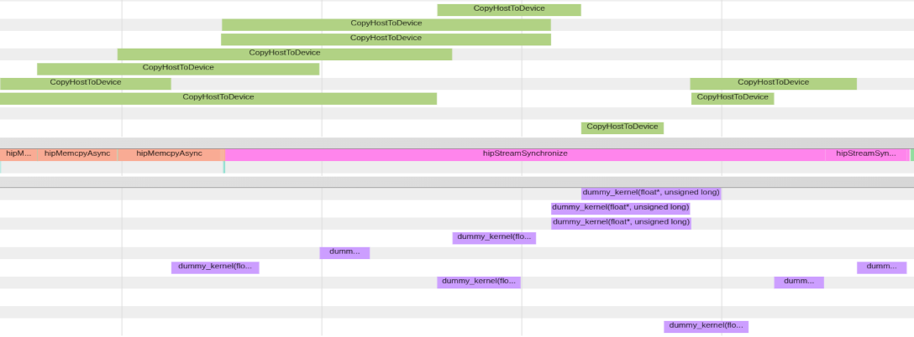

# Outline

* Memory model and hierarchy
* Memory management strategies
* Page-locked memory
* Asynchronous memory allocation

# Preface: Virtual Memory addressing

::::::{.columns}
:::{.column width=70%}
- Modern operating systems utilize virtual memory
    - Memory is organized in memory pages
    - Memory pages can reside on swap area on the disk 
- `malloc` returns an address in the virtual memory
:::

:::{.column}
{width=80%}
:::
::::::

# Memory model and hierarchy

::::::{.columns}
:::{.column width="60%"}
::: {.fragment}
- Registers (*VGPR, SGPR*)
  - Compiler assigns automatically
:::
::: {.fragment}
- Shared memory (*Local data share, LDS*)
  - User controlled
  - Shared by threads in a block
:::
::: {.fragment}
- Local memory (*Scratch*)
  - Automatically used when registers run out
:::
::: {.fragment}
- Global device memory
:::
::: {.fragment}
- Host memory
:::
:::
::: {.column width="40%"}
{width=100%}
:::
::::::

::: {.notes}
Extra: 
- Not covered: texture memory, constant memory
- Could be considered only when lower hanging optimisation tricks are covered
- This lecture: host ⇄ global device memory
:::

# Section 1: Memory management strategies {.section}

# Memory management strategies

Memory management can be *Explicit* or *Implicit*.

:::{.incremental}
- *Explicit*: User manually manages data movement between host and device. Host memory can be allocated with GPU-unaware allocators (`malloc`/`free` etc)
- *Implicit*: The runtime manages data movement between host and device. Host memory needs to be allocated with special allocators.
  - **Managed memory** (unified shared memory): Page faults will initiate data movement
:::

* [HIP API documentation on memory](https://rocm.docs.amd.com/projects/HIP/en/docs-6.3.3/doxygen/html/group___memory_m.html)

# Memory management strategies

::::::{.columns}
:::{.column}

:::{.fragment}
<small>
Explicit memory management
```cpp
int main() {
 int *A, *d_A;
 A = (int *) malloc(N*sizeof(int));
 hipMalloc((void**)&d_A, N*sizeof(int));
 ...
 /* Copy data to GPU and launch kernel */
 hipMemcpy(d_A, A, N*sizeof(int), hipMemcpyHostToDevice);
 kernel<<<...>>>(d_A);
 hipMemcpy(A, d_A, N*sizeof(int), hipMemcpyDeviceToHost);
 hipFree(d_A);
 // result is in A
 free(A);
}
```
</small>
:::
:::
:::{.column}

:::{.fragment}
<small>
Unified Memory management
```cpp
int main() {
 int *A;
 hipMallocManaged((void**)&A, N*sizeof(int));
 ...
 /* Launch GPU kernel */
 kernel<<<...>>>(A);
 hipStreamSynchronize(0);
 // result is in A
 hipFree(A);
}
```
:::

</small>

:::
::::::


# Unified Memory pros & cons

::::::{.columns}
:::{.column}
:::{.fragment}
**Pros**

- Incremental development
- Increased developer productivity
  - Especially on large codebases with complex data structures
- Data transfer can be optimized later
  - With prefetches and hints
:::
:::

:::{.column}
:::{.fragment}
**Cons**

- Data access in device code is initially slower <br>⇒ Must be optimized with prefetches and hints
- Externalize memory management to library
:::
:::
::::::

# Unified memory: Prefetching

- Unified memory automatically migrates memory pages between CPU and GPU
- Without prefetching:
  - Memory pages migrate on-demand
  - First GPU access may trigger page faults
- Programmer can proactively move pages to the GPU before execution
  ```cpp
  hipError_t hipMemPrefetchAsync(void *dev_ptr, size_t size, int device, hipStream_t stream);
  ```

# Explicit memory API calls

- Allocate device memory
  ```cpp
  hipError_t hipMalloc(void **devPtr, size_t size)
  ```

- Copy data
  ```cpp
  hipError_t hipMemcpy(void *dst, const void *src, size_t count, enum hipMemcpyKind kind)
  ```
  Where `kind`:
    - **`hipMemcpyDefault`**, *or* <br> `hipMemcpyDeviceToHost`, `hipMemcpyHostToDevice`, <br>`hipMemcpyHostToHost`, `hipMemcpyDeviceToDevice`

- Deallocate device memory
  ```cpp
  hipError_t hipFree(void *devPtr)
  ```

# Unified memory API calls

Also known as [*Managed memory*](https://rocm.docs.amd.com/projects/HIP/en/docs-6.3.3/doxygen/html/group___memory_m.html)

- Allocate Unified Memory
  ```cpp
  hipError_t hipMallocManaged(void **devPtr, size_t size)
  ```
- Deallocate unified memory (same as explicitly managed memory)
  ```cpp
  hipError_t hipFree(void *devPtr)
  ```
- Prefetch (asynchronously):
  ```cpp
  hipError_t hipMemPrefetchAsync( void *dev_ptr, size_t size, int device, hipStream_t stream)
  ```
- Advise about memory access (more in [HIP API Documentation](https://rocm.docs.amd.com/projects/HIP/en/docs-6.3.3/doxygen/html/group___global_defs.html#ga2757323c1ac94b1d71f699fcbd5bdc2f))
  ```cpp
  hipError_t hipMemAdvise(void *dev_ptr, size_t size, hipMemoryAdvise advise, int device)
  ```

# Summary about memory management

- Memory management can be *Explicit* or *Implicit*
- Unified memory handles memory management between host and device "automatically"
- Any questions about explicit vs. implicit memory management?

# Section 2: Efficient memory transfers with pinned host memory {.section}

# Pageable vs. page-locked memory?

::::::{.columns}
:::{.column width=90%}
- Modern operating systems utilize virtual memory
    - Memory pages can reside on swap area on the disk
- GPU DMA transfers require memory pages to remain resident during the transfer
- Page-locked ("pinned") memory prevents the OS from swapping these pages out
:::

:::{.column}
{width=60%}
:::
::::::

# Page-locked (or pinned) memory

:::{.fragment}
- Normal `malloc` allows swapping, page migration and page faults
- `hipHostMalloc` page-locks the allocation to a physical memory location
  - Deallocate with `hipFreeHost()`

Benefits of page-locking:
:::

:::{.incremental}

1. ***Allow actually asynchronous memory copies***
2. (possibly) Higher transfer speeds between host and device via direct memory access (DMA)
3. Can access host memory from GPU without explicit hipMemcpy (**very slow**)

:::

:::{.notes}
- having too much page-locked allocs is almost never a problem
:::

# Asynchronous memcopies

- Normal `hipMemcpy()` calls are blocking (ie, synchronizing)
    - The execution of host code is blocked until copying is finished
- To overlap copying and program execution, use asynchronous functions
    - Such functions have Async suffix, eg, `hipMemcpyAsync()`
- User has to synchronize the program execution
- Concurrency with memory copy and computation requires page-locked host allocations

# Async memory copy with regular vs page-locked memory



:::{.fragment}

:::

# Explicit memory API calls

Page-locked host memory

- Allocate/free page-locked host memory
  ```cpp 
    hipHostMalloc(void **ptr, size_t size);
    hipHostFree(void *ptr);
  ```
- Memory copy functions are the same as with normally allocated memory

:::{.notes}
- the speedup is not very big usually
:::

# Section 3: Asynchronous memory allocation {.section}

# Asynchronous allocation: The stream-ordered memory allocator and memory pools 

- Benefit of asynchronous memory management: allocate/free memory from/to a pool

<small>

| Description | API call |
|--|--|
| Allocate memory from pool. If pool is too small, assign more memory to it. | `hipMallocAsync(void** devPtr, size_t size, hipStream_t hStream)` |
| Free memory to the pool in the specific stream | `hipFreeAsync(void* devPtr, hipStream_t hStream)` |

</small>

:::{.notes}
**Extra:**
- Modify default behaviour: resize pool down to value when synchronizing (`hipDeviceGetDefaultMemPool`, `hipMemPoolSetAttribute`, `hipMemPoolAttrReleaseThreshold`)
- beta version
:::

# Memory pools - Example
<small>

<div class="column">
Example 1 - slow
```cpp
for (int i = 0; i < 100; i++) {
  // Allocate memory here (slow)
  hipMalloc(&ptr, size); 
  // Run GPU kernel
  kernel<<<..., stream>>>(ptr);
  // Deallocate memory here
  hipFree(ptr); 
}
// Synchronize the default stream (no influence to memory allocations)
hipStreamSynchronize(0); 
```
* Allocating and deallocating memory in a loop is slow, and can have a significant impact on the performance
</div>
<div class="column">
Example 2 - fast
```cpp
for (int i = 0; i < 100; i++) {
  // Obtain unused memory from the current memory pool, 
  // more memory is allocated for the pool if needed
  hipMallocAsync(&ptr, size, stream); 
  // Run GPU kernel
  kernel<<<..., stream>>>(ptr);
  // Return memory to the current memory pool
  hipFreeAsync(ptr, stream); 
}
// Synchronize 
hipStreamSynchronize(stream); 
```
* Recurring memory allocation and deallocation does not occur anymore, because
  the memory is obtained from the memory pool 

</div>
</small>

:::{.notes}
- ROCm has memory leak bug related to mallocasync and freeasync
:::

# Summary

- Host and device have separate physical memories
  - The data copies between CPU and GPU should be minimized
- Explicit or implicit memory management
  - Unified Memory: improve productivity and cleaner implementation
- Page-locked host allocation: DMA and kernel access to host memory
- Asynchronous allocation and deallocation: memory pools
