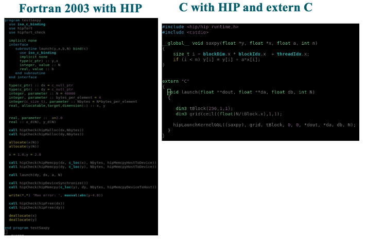

# Fortran

* No kernels in Fortran:
    - HIP functions are callable from C, using `extern C`
    - compile HIP functions (containing kernels) with hipcc
* Fortran + HIP:
    - link with Fortran
    - needs wrappers and interfaces for all HIP calls
* Hipfort:
    - link with hipcc
    - Fortran Interface For GPU Kernel Libraries
      - HIP: HIP runtime, hipBLAS, hipSPARSE, hipFFT, hipRAND, hipSOLVER
      - ROCm: rocBLAS, rocSPARSE, rocFFT, rocRAND, rocSOLVER
      - memory management: `hipMalloc`, `hipMemcpy`

# HIPFort code for SAXPY

{.center width=1200px}

# Summary

* No native GPU support in Fortran
* HIP functions are callable from C, using `extern C`
  - `iso_c_binding` 
  - GPU objects are of type `c_ptr` in Fortran
* Hipfort provides Fortran interfaces for GPU libraries