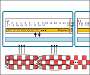
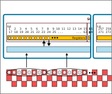
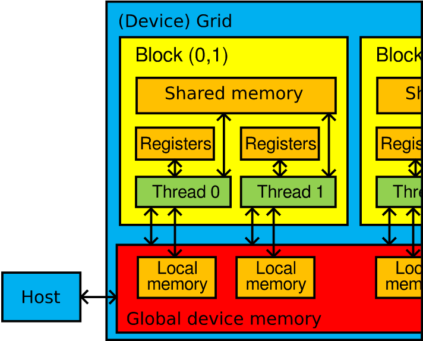
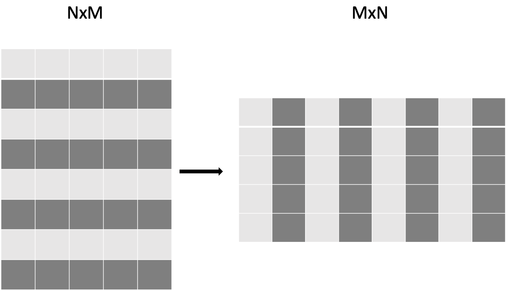

# Overview

- General optimisation strategies
- Optimizing memory access
- Other GPU kernel optimisations

# Measuring performance

- Before starting any performance optimisation one needs to find out the current bottlenecks and where they occur
- Typical bottlenecks
    - host-device data transfers
    - too little parallelism for GPUs
    - unoptimal memory access
    - unoptimal kernel code

# Performance analysis tools

- Applications own timing information
    - can be useful for big picture
    - GPU execution is asynchronous, remember to synchronize or use events
- Performance analysis tools
    - provide detailed information about the application
    - find hot-spots (functions and loops)
    - identify causes of less-than-ideal performance
    - information about low-level hardware via performance counters
- ROCProfiler and ROCm Compute Profiler, Nsight Systems and Nsight Compute
- ScoreP, TAU, ...


# Timers in application

- As GPU kernels are run asynchronously, timers in application need to use events or explicit 
  synchronization in measurements

<div class="column">
```cpp
hipEventRecord(start);

kernel<<<grid, block>>>(...);

hipEventRecord(stop);

hipEventSynchronize(stop);

float ms = 0.0f;
hipEventElapsedTime(&ms, start, stop);
```
- Measures only the time spent on GPU
</div>
<div class="column">
```cpp
auto start = clock();

kernel<<<grid, block>>>(...);
hipDeviceSynchronize();

auto stop = clock();


float ms = (stop - start) * 1e3;
```
- Measures also kernel launch latency
</div>

# Example: rocprof

<small>
```
$ rocprofv3 ... --summary
ROCPROFV3 SUMMARY:

|         NAME                    |     DOMAIN      |  CALLS  | DURATION (nsec) | AVERAGE (nsec)  | PERCENT (INC) |
|---------------------------------|-----------------|---------|-----------------|-----------------|---------------|
| hipDeviceSynchronize            | HIP_API         |     500 |      7090308646 |       1.418e+07 |     32.114109 |
| evolve_interior_kernel          | KERNEL_DISPATCH |     500 |      7078549847 |       1.416e+07 |     32.060850 |
| hipHostMalloc                   | HIP_API         |       4 |      4611150006 |       1.153e+09 |     20.885265 |
| hipHostFree                     | HIP_API         |     506 |       954823088 |       1.887e+06 |      4.324677 |
| hipMemcpy                       | HIP_API         |       4 |       669220623 |       1.673e+08 |      3.031099 |
| evolve_z_edges_kernel           | KERNEL_DISPATCH |     500 |       359599504 |       7.192e+05 |      1.628733 |
| evolve_y_edges_kernel           | KERNEL_DISPATCH |     500 |       351679420 |       7.034e+05 |      1.592860 |
| MEMORY_COPY_DEVICE_TO_HOST      | MEMORY_COPY     |       2 |       327768938 |       1.639e+08 |      1.484563 |
| MEMORY_COPY_HOST_TO_DEVICE      | MEMORY_COPY     |       2 |       323637352 |       1.618e+08 |      1.465849 |
| hipStreamCreateWithFlags        | HIP_API         |       3 |       269246481 |       8.975e+07 |      1.219497 |
| evolve_x_edges_kernel           | KERNEL_DISPATCH |     500 |        21772863 |       4.355e+04 |      0.098616 |
| hipLaunchKernel                 | HIP_API         |    2000 |        13302271 |       6.651e+03 |      0.060250 |
```
</small>

# Optimisation strategies

1. Minimise host-device data transfers
2. Use existing libraries
3. Optimise for coalesced memory access
4. Other kernel optimisations

# Host-device data transfers

## Peak theoretical bandwidth

| Link | Host-device | Device memory | 
|------|------------:|--------------:|
| MI250x (LUMI) | 36 GB/s | 1600 GB/s|
| A100 (Mahti) | 32 GB/s | 2000 GB/s |
| GH200 (Roihu) | 900 GB/s | 4000 GB/s |

- Matrix multiplication $C = A \times B$ with 10000 x 10000 matrices in LUMI:
    - Host-to-device memory copies: 0.07 s
    - Computation: 0.04 s

::: notes

Theoretical performance:

- memcopies: `3 * 10000**2 * 8 / 36e9`
- compute: `2 * 10000***3 / 47e12`

:::

# Using libraries

- Optimized libraries can provide several orders of more performance

<small>
<div class="column">
Naive matrix multiplication
```cpp
__global__ void matmul_kernel(int order, float *A, float *B, float *C)
{
  auto i = blockIdx.x * blockDim.x + threadIdx.x;
  auto j = blockIdx.y * blockDim.y + threadIdx.y;

  if ((i < order) && (j < order)) {
    for(int k = 0; k < order; ++k) {
      C[i+j*order] += A[i + k*order] * B[k + j*order];
    }
  }
}

matmul_kernel<<<dimGrid, dimBlock>>>(order, d_a, d_b, d_c);
```
- 2.8 s (LUMI, order=10 000)
</div>
<div class="column">
Matrix multiplication with hipBLAS
```cpp
  hipblasHandle_t h;
  hipblasCreate(&h);


  hipblasDgemm(h, 
               HIPBLAS_OP_N, HIPBLAS_OP_N,
               order, order, order,
               &alpha,            
               d_a, order,          
               d_b, order,
               &beta, 
               d_c, order);
```
- 0.05 s (LUMI, order=10 000)
</div>
</small>

::: notes

- Before you optimize, use libraries

:::

# Common libraries (I)

| NVIDIA   | HIP       | ROCm       | Description                                                                         |
| -------- | --------- | ---------- | ----------------------------------------------------------------------------------- |
| cuBLAS   | hipBLAS   | rocBLAS    | Basic Linear Algebra Subroutines                                                    |
| cuFFT    | hipFFT    | rocfft     | Fast Fourier Transforms                                                             |
| cuRAND   | hipRAND   | rocRAND    | Random number generation                                                            |
| cuSOLVER | hipSOLVER | rocSOLVER  | Dense and sparse linear algebra (LAPACK)                                            |
| Thrust   |           | rocThrust  | Parallel algorithms (C++ STL-like)                                                  |
| CUB      | hipCUB    | rocPRIM    | Low level parallel primitives                                                       |


# Common libraries (II)

| NVIDIA   | HIP       | ROCm       | Description                                                                         |
| -------- | --------- | ---------- | ----------------------------------------------------------------------------------- |
| cuSPARSE | hipSPARSE | rocSPARSE  | Sparse BLAS + SMV                                                                   |
| AMG-X    |           | rocALUTION | Sparse iterative solvers and preconditioners with Geometric and Algebraic MultiGrid |
| EIGEN    | EIGEN     | EIGEN      | Linear algebra 
| cuDNN    |           | MIOpen     | Deep neural network primitives
| NCCL     |           | RCCL       | multi-GPU communication                                                             |

# Optimizing memory access {.section}

# Recap: warp / wavefront

- Threads are grouped into
    - *warps* of 32 consecutive threads (Nvidia), or
    - *wavefronts* of 64 consecutive threads (AMD)
- The whole warp/wavefront executes the same instruction in lockstep
- Memory loads/stores are also executed in lockstep
    - warp stalls until all memory accesses of its threads are resolved


# Optimising for coalesced memory access

- Device main memory is accessed in batches of 64 or 128 bytes (cache line)
- If warp requests consecutive elements, hardware can combine (**coalesce**) the requests into 
  fewer transactions

  |  |  |  |
  |--|--|--|
  | stride-1 | "`double val = global_mem[tid]`" | ***fast*** 🐇 |
  | stride-64 |"`double val = global_mem[tid*8]`" | ***slow*** 🐢 |

- Non-linear access is fine as long as the warp as a whole accesses consecutive elements in global memory

---

# Uncoalesced memory access

::::::{.columns}
:::{.column width="50%"}
{width="100%"}
<div align=right>
{width="3cm"}
</div>
:::
:::{.column}

* 6 read operations for 6 elements
```cpp
double val = global_array[8*tid];
```
:::
::::::


---

# Coalesced memory access

::::::{.columns}
:::{.column width="50%"}
{width="100%"} 
<div align=right>
{width="3cm"}
</div>
:::
:::{.column}
* 2 read operations for 16 elements
```cpp
double val = global_array[tid];
```
:::

::::::


---

# Coalesced access with multidimensional thread blocks and grids

- Multidimensional thread blocks and grids have `threadIdx.[x|y|z]`, `blockIdx.[x|y|z]` *etc.*
  indices
- The first index `x` varies fastest contrary to C/C++ multidimensional array ordering
    
<small>
<div class="column">
**Uncoalesced access**
```cpp
__global__ void copy(int width, int height, float *A, float *B)
{
  auto x = blockIdx.x * blockDim.x + threadIdx.x;
  auto y = blockIdx.y * blockDim.y + threadIdx.y;

  auto index = x * height + y;

  B[index] = A[index]
}

```
</div>
<div class="column">
**Coalesced access**
```cpp
__global__ void copy(int width, int height, float *A, float *B)
{
  auto x = blockIdx.x * blockDim.x + threadIdx.x;
  auto y = blockIdx.y * blockDim.y + threadIdx.y;

  auto index = y * width + x;

  B[index] = A[index]
}

```
</div>
</small>
   
# Device memory hierarchy

**Fastest first**

::::::{.columns}
:::{.column width=60%}
- Registers (per-thread-access)
- Shared memory (per-block-access)
- Local memory (per-thread-access)
- Global memory (global access)
:::
:::{.column}
{width=100%}
:::
::::::

# Device memory hierarchy

<div class="column">
::: {.fragment}
- Registers (per-thread-access)
    - Used automatically
    - $\sim$ kilobytes
    - Very fast access
:::
::: {.fragment}
- Shared memory (per-block-access)
    - User controlled with `__shared__` keyword
    - $\sim$ kilobytes
    - Fast access
:::
</div>

<div class="column">
::: {.fragment}
- Local memory (per-thread-access)
    - Used automatically if all registers are reserved
    - Local memory resides in global memory
    - Very slow access
:::
::: {.fragment}
- Global memory (per-device-access)
    - Managed by the host with HIP API
    - $\sim$ gigabytes
    - Very slow access
:::
</div>

---

# Using shared memory

- Accessing shared memory is faster than the global device memory
- Shared within a block
    - Synchronization with `__syncthreads()`
- Amount of available shared memory depends on the architecture
- Use cases:
  - reduce overlapping global memory operations
  - User controlled cache
  - Transform uncoalesced memory operations to coalesced

# Using shared memory

- Shared memory is declared within the kernel with `__shared__` keyword
- Shared memory can be static or dynamic
    - kernel can have multiple shared memory arrays but only a single dynamic
    - size of the dynamic shared memory is specified in the third argument in the kernel launch `kernel<<<blocks, threads, shmem>>>()`

<small>
<div class="column">
**Static shared memory**
```cpp
__global__ void kernel(...)
{
  __shared__ float buf[256];
  __shared__ int buf2[256];
...
}

kernel<<<blocks, threads>>>(...)
```
</div>
<div class="column">
**Dynamic shared memory**
```cpp
__global__ void kernel(...)
{
  extern __shared__ float buf[];
...
}

size_t shmem = n * sizeof(float) // given to kernel in bytes
kernel<<<blocks, threads, shmem>>>(...)
```
</div>
</small>

---

# Example: Matrix transpose with shared memory (I)

<small>
<div class="column" style=width:55%>
Naive implementation
```cpp
__global__ void transpose_kernel(float *in, float *out, 
                                 int width, int height) {

  int x_index = blockIdx.x * tile_dim + threadIdx.x;
  int y_index = blockIdx.y * tile_dim + threadIdx.y;

  int in_index = y_index * width + x_index;
  int out_index = x_index * height + y_index;

  out[out_index] = in[in_index];
}
```
</div>
<div class="column" style=width:42%>
Either reads or writes are uncoalesced
{.center width=80%}
</div>
</small>

# Example: Matrix transpose with shared memory (II)

<small>
<div class="column" style=width:55%>
Implementation with shared memory
```cpp
__global__ void transpose__kernel(float *in, float *out, 
                                  int width, int height) {

  __shared__ float tile[tile_dim][tile_dim];

  int x_tile_index = blockIdx.x * tile_dim;
  int y_tile_index = blockIdx.y * tile_dim;

  int in_index =
      (y_tile_index + threadIdx.y) * width + (x_tile_index + threadIdx.x);
  int out_index =
      (x_tile_index + threadIdx.y) * height + (y_tile_index + threadIdx.x);

  tile[threadIdx.y][threadIdx.x] = in[in_index];

  __syncthreads();

  out[out_index] = tile[threadIdx.x][threadIdx.y];
}
```
</div>
<div class="column" style=width:42%>
Both reads and writes are coalesced
{.center width=60%}
</div>
</small>

# Other examples where shared memory is important

- Matrix-matrix/vector multiplication
 
  :::{.fragment}
  - Same elements are loaded in different threads
  :::
- N-body problem
 
  :::{.fragment}
  - One thread evolves one body: each thread loads all data of each other body as well
  :::
- Reductions
 
  :::{.fragment}
  - Cooperation between threads
  :::

# Other kernel optimizations {.section}

# Avoid branching within wavefront/warp

::::::{.columns}
:::{.column width=60%}
- Branching within wavefront/warp serializes execution 
- If the branch changes only between warps, then there is no penalty
- Branch divergence hurts most for compute bound or memory divergent branches
- Memory bound branches with no divergence are less sensitive
:::
:::{.column width=39%}
```cpp
if ( (tid%2) == 0) {
  c[tid] = b[tid]-a[tid];
} else {
  c[tid] = a[tid]-b[tid];
}
```
:::
::::::

::: notes
  - GPUs have so much computing power that executing all branches is usually fine
:::

---

# Branching across wavefronts/warps


::::::{.columns}
:::{.column width=49%}
*No divergence*
```cpp
if ((tid/64)%2 == 0) {
  x[tid] = f_1(double(tid), ...);
} else {
  x[tid] = f_2(double(tid), ...);
}
```
*Branch divergence*
```cpp
if(tid%2 == 0) {
  x[tid] = f_1(double(tid), ...);
} else {
  x[tid] = f_2(double(tid), ...);
}
```
:::
:::{.column width=49%}
 
 Table: Effect of branching

  | Branching | time (µs) |
  |-----------|-----:|
  | *No divergence* | 970 |
  | *Branch divergence* | 1900|
  | *single branch* | 1000 |

- `f_1` and `f_2` are sufficiently complicated $\Rightarrow$ *not* memory-bound

:::
::::::

::: notes
- Exercise: Find out how complicated `f_1` and `f_2` need to be that branch divergence is an issue
:::

# Optimize occupancy

- Occupancy is the ratio of active wavefronts/warps to the maximum CU/SM can support
- High occupancy helps to hide latencies
    - However, high occupancy does not automatically mean good performance 
    - Compute bound kernels may perform better with lower occupancy
- Occupancy is determined by
    - register per thread
    - threads per block
    - shared memory per block
    - hardware limits

# MI250x Compute Units (CU)
::::::{.columns}

:::{.column width=55%}

- 64 kiB of **local data share** (LDS) memory
- 800 *scalar registers* (**SGPR**, 12.6 kiB)
  - up to 102 per wavefront
- 32 wavefront slots
<!--- not relevant for occupancy
- 16 kiB of L1 cache
--->
:::

:::{.column width=45%}
{.center width=90%}
:::
::::::

- 4$\times$SIMD units, 16 threads per SIMD unit
  - 64 kiB *vector register* (**VGPR**) storage per SIMD unit $\Rightarrow$ 256 kiB register storage on CU
  - 512 4-byte registers per thread (2 kiB). 


::: notes
- Simplification
- Ballpark sizes for registers, LDS and cache
- MI250x GCD has 110 compute units
  - Note: Cache is per CU
  - CPU: 32 kiB L1 cache per core
- Lot of register storage
- MI250x has also matrix units but they are tricker. Need intrinsics.
- `hipcc -Rpass-analysis=kernel-resource-usage`!
:::

# Calculating (theoretical) occupancy

- Kernel uses 81 vector registers (VGPRs) 
    - a wavefront uses 5184 VGPRs 
    - CU can accommodate 65536 / 5184 = 12 wavefronts
    - occupancy 12 / 32 = 38 %
- Block uses 16 kiB shared memory
    - maximum of 4 blocks 
    - with 256 threads per block max. 16 wavefronts
    - occupancy 16 / 32 = 50 %
- `hipcc` can report occupancy with `-Rpass-analysis=kernel-resource-usage`

::: notes
32 bit numbers assumed for registers
::: 


# Minimise register spilling 

- Local variables are stored in registers
  - MI250x 128 kiB per SIMD-unit
- What happens if there is not enough registers? 
  - Variables are "spilled" to local memory on slow global device memory
- Might happen if the kernel is very complicated
  - Reducing occupancy may improve performance


# Optimizing kernel launch latency

- Launching a kernel has non-neglible cost
    - Can be significant especially for small kernels
- Fuse small kernels to larger ones (note however register pressure)
- Launch independent kernels in different streams
- Utilize HIP/CUDA graphs


# Summary

- Host-Device vs Device-Compute Unit bandwidth difference is 2 orders of magnitude
- Specialised libraries are highly optimised
  - Especially dense linear algebra (hipBLAS/cuBLAS) and FFTs.
- Neighbouring threads access neighbouring memory locations
  - Memory operations are coalesced
- Shared memory: fast memory shared within a block
- Keep data in registers 
  - But there are a finite amount of registers!
- Avoid branching within wavefront/warp


