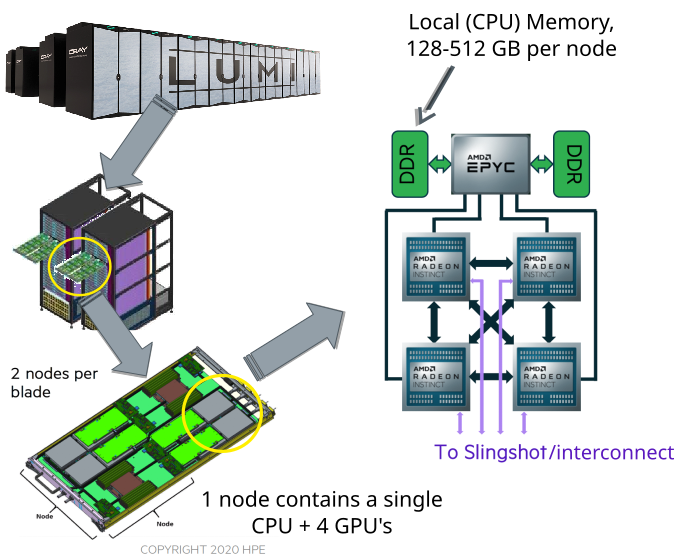
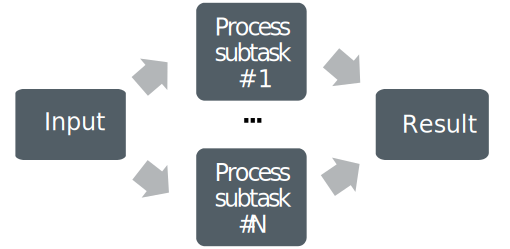
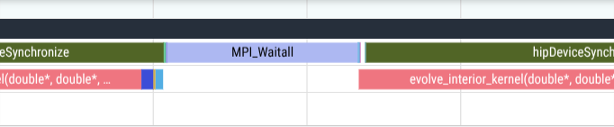

# Anatomy of supercomputer

<div class="column" style=width:58%>
- Supercomputers consist of nodes connected by a high-speed network
- A node can contain several multicore CPUs and several GPUs
    - 8 GPUs per node in LUMI, 4 GPUs per node in Mahti and Roihu
- All CPU memory within a node is shared
- GPU memories within a node are distinct
</div>
<div class="column" style=width:38%>
{.center width=80%}
<small>Lumi - Pre-exascale system in Finland</small>
</div>

# Using multiple GPUs

- Why to use multiple GPUs?
    - Application requires more memory than a single GPU has
    - Solve a problem faster than possible with a single GPU
- In order to use multiple GPUs one needs to:
    - Coordinate the work between GPUs
    - Move data between GPUs
- HIP/CUDA has functionality for intranode data movement
- MPI and RCCL/NCCL can be use both for intra- and internode data movement

# Computing with multiple GPUs

- A problem is split into smaller subtasks
- Multiple subtasks are processed simultaneously using multiple GPUs
    - standard HIP/CUDA programming for each GPU

<!--
Copyright CSC
SPDX-FileCopyrightText: 2026 CSC - IT Center for Science Ltd. <www.csc.fi>

SPDX-License-Identifier: CC-BY-4.0
-->

{.center width=40%}

# Processes and threads

<!-- Copyright CSC -->
 {.center width=80%}
<div class=column>
**MPI: Processes**

- independent execution units
- MPI launches N processes at application startup
- works over multiple nodes
- data exchange via messages
</div>
<div class=column>

**OpenMP: Threads**

- threads share memory space
- threads are created and destroyed  (parallel regions)
- limited to a single node
- directive based

</div>

# Multi-GPU Programming Models

<div class="column">
* One GPU per process
    * syncing is handled through message passing (e.g. MPI)
* Many GPUs per process
    * process manages all context switching and syncing explicitly
* One GPU per thread
    * syncing is handled through thread synchronization requirements
</div>

<div class="column">
{width=50%}
{width=50%}
{width=50%}
</div>

# One GPU per process

- Most common approach for HPC applications
- Communication between GPUs with MPI or NCCL/RCCL
- Works with arbitrary number of GPUs 
    - same programming approach for inter- and intranode data movement
- Each process interacts with only one GPU which makes the implementation
  easier and less invasive (if MPI is used anyway)
- Very similar MPI programming as with CPUs

# GPU selection in a MPI program

- By default, each process sees all the GPUs
- In order to use different GPUs for different processes one needs to 
  make a process specific selection 

```cpp
int deviceCount, nodeRank;
MPI_Comm commNode;
MPI_Comm_split_type(MPI_COMM_WORLD, MPI_COMM_TYPE_SHARED, 0, MPI_INFO_NULL, &commNode);
MPI_Comm_rank(commNode, &nodeRank);
hipGetDeviceCount(&deviceCount);
hipSetDevice(nodeRank % deviceCount);
```
::: notes
* Can be done from slurm using `ROCR_VISIBLE_DEVICES` or `CUDA_VISIBLE_DEVICES`
:::

# Device Selection and Management

- Query the number of available GPUs within a node
```cpp
hipError_t hipGetDeviceCount(int *count)
```
- Set `device` as the current device for the calling host thread (device numbering starts from 0)
```cpp
hipError_t hipSetDevice(int device)
```
- Query the current device for the calling host thread
```cpp
hipError_t hipGetDevice(int *device)
```
- Reset and destroy all current device resources
```cpp
hipError_t hipDeviceReset(void)
```

# Compiling MPI+HIP Code

- Trying to compile code with HIP calls with other than the `hipcc`
  compiler can result in errors
- Either set MPI compiler to use `hipcc`, eg for OpenMPI:
```bash
OMPI_CXXFLAGS='' OMPI_CXX='hipcc'
```
- or separate HIP and MPI code in different compilation units compiled with
  `mpicxx` and `hipcc`
    * Link object files in a separate step using `mpicxx` or `hipcc`
- **on LUMI, `cc` and `CC` wrappers know about both MPI and HIP**


# GPU-GPU Communication through MPI

* CUDA/ROCm aware MPI libraries support direct GPU-GPU transfers
    * can take a pointer to device buffer (avoids host/device data copies)
* currently no GPU support for custom MPI datatypes (must use a
  datatype representing a contiguous block of memory)
    * data packing/unpacking must be implemented application-side on GPU
* on LUMI, enable on runtime by `export MPICH_GPU_SUPPORT_ENABLED=1`
* having a fallback for pinned host staging buffers is a good idea.

# Example: HIP + MPI program

```cpp
hipMalloc((void **) &dA, sizeof(double) * N);
hipMalloc((void **) &dB, sizeof(double) * N);
...
hipSetDevice(nodeRank % deviceCount);
...
MPI_Send(dA, ...)
MPI_Recv(dB, ...)
gpu_kernel<<<gridsize, blocksize>>> (dB, N);
```

# Overlapping communication and computation

- Non-blocking MPI operations make it possible to start and complete communication in separate steps
    - A CPU may still be needed for the message progress $\Rightarrow$ overlapping
      CPU computation with communication not necessarily possible
- GPU is capable of concurrent computation and memory copies
- Host CPU is available for message progress $\Rightarrow$ more potential for 
  overlapping

# Overlapping communication and computation

<div class="column">
{width=80%}
</div>
<div class="column">
{width=80%}
</div>

<br>

```cpp
MPI_Isend(boundary_data, ...)
MPI_Irecv(boundary_data, ...)
compute_interior<<<gridsize, blocksize>>> (interior_data, ...);
MPI_Waitall(...)
compute_boundaries<<<gridsize, blocksize>>> (boundary_data, ...);
```


# Summary

- there are various options to write a multi-GPU program
- use `hipSetDevice()` to select the device, and the subsequent HIP calls
  operate on that device
- often best to use one GPU per process, and let MPI handle data transfers between GPUs 
- GPU-aware MPI is required when passing device pointers to MPI
     - Using host pointers does not require any GPU awareness
- GPU-aware MPI provides possibility for overlapping communication and computation
