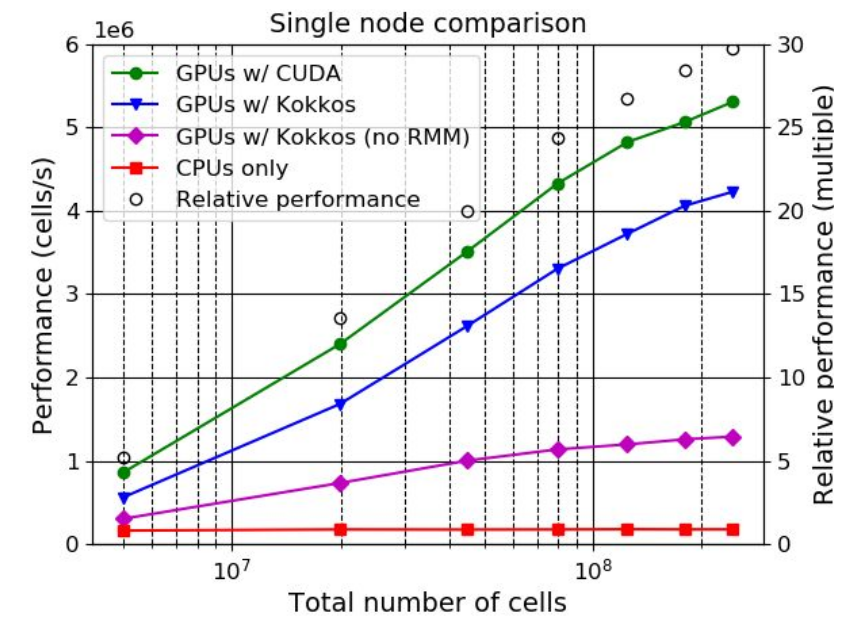

# Outline

* Introduction
* Conditional compilation
* General kernels with lambda functions
* Memory management
* Hipify-tools - translating CUDA to HIP
* Error checking reminder

# Introduction

* Ok, now we know some HIP functions, so how to apply this knowledge to real projects?
* How to separate the architecture specific code from the numerical methods?
* How to make HIP an optional feature, and allow my code to still compile with plain C compiler?
* Do I need to rewrite all 150 loops in my huge codebase with a device kernel for each?

# Conditional compilation

<small>
<div class="column">

* Many projects find it desirable to add HIP as an optional dependence 
* However, this can lead lead to a messy code base which is difficult to maintain (see the example ->)
  * The issue can be avoided by separating the architecture and the numerical implementation (separation of concerns)
* For example, let's try putting HIP code in arch_hip.h and the respective non-HIP code in arch_host.h (see the next slides)
  * Architecture-specific code is kept separately in one place
  * This approach works very nicely with generic GPU kernels that exploit lambda functions
</div>

<div class="column">

```cpp
#if defined(HAVE_HIP)
  #include <hip/hip_runtime.h>
#endif

int main(){
  int* ptr;
  #if defined(HAVE_HIP)
    hipMallocManaged(&ptr, 1024);
  #else
    ptr = malloc(1024);
  #endif
  /* Do something here*/
  #if defined(HAVE_HIP)
    /* Run GPU loop (kernel) */
  #else
    /* Run CPU loop */
  #endif
  /* Do something here */
  #if defined(HAVE_HIP)
    hipFree(ptr);
  #else
    free(ptr);
  #endif
}
```
</div>
</small>

# Conditional compilation with separation of concerns

<small>
<div class="column">

* .cpp file
```cpp
/* HAVE_DEF determines which accelerator backend 
 * is used (and is checked only ONCE) */
#if defined(HAVE_HIP)
  #include "arch_hip.h"
#else
  #include "arch_host.h"
#endif

/* The main function */
int main(){

  /* Memory allocation depends on the attached 
   * header, ie, the chosen architecture */
  int* array = (int*) arch::alloc(1024);
  
  /* Here do something with the array */
  
  /* Memory deallocation depends on the attached 
   * header, ie, the chosen architecture */
  arch::dealloc(array);
}
```
</div>

<div class="column">

* .h files (headers)
```cpp
/* arch_hip.h */
#include <hip/hip_runtime.h>
namespace arch{
  static void* alloc(size_t bytes) {
    void* ptr;
    hipMallocManaged(&ptr, bytes);
    return ptr;
  }
  static void dealloc(void* ptr) {
    hipFree(ptr);
  }
}
```

```cpp
/* arch_host.h */
namespace arch{
  static void* alloc(size_t bytes) {
    return malloc(bytes);
  }
  static void dealloc(void* ptr) {
    free(ptr);
  }
}
```
</div>
</small>


# General GPU kernels - Lambda function

<small>
<div class="column">

* In C++, lambda functions can be used to create general GPU kernels
* Lambda function is a function object which can be passed for other functions as an argument
* Lambda function can "capture" other variables by reference [&] or by value [=] from the scope where it is defined
* Lambda functions work nicely with the conditional compilation approach
  * The loop contents can be put into a lambda function, which are then executed by the chosen method (eg, a HIP kernel or a sequential for-loop running on host)
</div>

<div class="column">

* Lambda function example with capture 
```cpp
#include <stdio.h>
int main() {
  int i = -9;
  /* Define a lambda function which captures the 
   * required variables by their value, ie, [=] */
  auto lambda = [=](int j) {
    printf("i = %d (captured value), j = %d (passed value) \n", i, j);
  };
  /* Call the lambda function in a loop */
  for(i = 0; i < 3; i++)
    lambda(i);
  return 0;
}
```
```
Output:
i = -9 (captured value), j = 0 (passed value) 
i = -9 (captured value), j = 1 (passed value) 
i = -9 (captured value), j = 2 (passed value) 
```
</div>
</small>

# General GPU kernels - Device execution
<small>
<div class="column">

* .cpp file
```cpp
#if defined(HAVE_HIP)
  #include "arch_hip.h"
#else
  #include "arch_host.h"
#endif

int main(){
  int n_array = 10;
  int* array = (int*) arch::alloc(n_array * sizeof(int));
  /* Run on host or on a device depending
   * on the chosen compile configuration */
  arch::parallel_for(n_array, 
    LAMBDA(const uint i) {
      array[i] *= 2;
    }
  );
  arch::dealloc(array);
}
```
* Lambda function can be passed to a GPU kernel by adding ```__host__ __device__``` identifiers, ie, by making it host-device lambda function

</div>

<div class="column">

* .h file (device header)
```cpp
/* arch_hip.h */
#include <hip/hip_runtime.h>
#define LAMBDA [=] __host__ __device__

namespace arch{
  static void* alloc(size_t bytes) { /* definition not shown */ }
  static void dealloc(void* ptr) { /* definition not shown */ }

  template <typename T> 
  __global__ static void hipKernel(T lambda, const uint loop_size){
    const uint i = blockIdx.x * blockDim.x + threadIdx.x;
    if(i < loop_size){
      lambda(i);
    }
  }
  template <typename T>
  static void parallel_for(uint loop_size, T loop_body){
    const uint blocksize = 64;
    const uint gridsize = (loop_size - 1 + blocksize) / blocksize;
    hipKernel<<<gridsize, blocksize>>>(loop_body, loop_size);
    hipStreamSynchronize(0);
  }
}
```
</div>
</small>

# General GPU kernels - Host execution
<small>
<div class="column">

* .cpp file
```cpp
#if defined(HAVE_HIP)
  #include "arch_hip.h"
#else
  #include "arch_host.h"
#endif

int main(){
  int n_array = 10;
  int* array = (int*) arch::alloc(n_array * sizeof(int));
  /* Run on host or on a device depending
   * on the chosen compile configuration */
  arch::parallel_for(n_array, 
    LAMBDA(const uint i) {
      array[i] *= 2;
    }
  );
  arch::dealloc(array);
}
```
* ```__host__ __device__``` identifiers are not used when compiled for host execution
</div>

<div class="column">

* .h file (host header)
```cpp
/* arch_host.h */
#define LAMBDA [=]

namespace arch{
  static void* alloc(size_t bytes) { /* definition not shown */ }
  static void dealloc(void* ptr) { /* definition not shown */ }

  template <typename T>
  static void parallel_for(uint loop_size, T loop_body) {
    for(uint i = 0; i < loop_size; i++){
      loop_body(i);
    }
  }
}
```
</div>
</small>

# Support for plain C interface through macros
<small>
<div class="column">

* .cpp file
```cpp
#if defined(HAVE_HIP)
  #include "arch_hip.h"
#else
  #include "arch_host.h"
#endif

int main(){
  int n_array = 10;
  int* array = (int*) arch_alloc(n_array * sizeof(int)); 
  /* Run on host or on a device depending
   * on the chosen compile configuration */
  int i;
  arch_parallel_for(n_array, i, 
  {
      array[i] *= 2;
  });
  arch_dealloc(array);
}
```
* The interface preserves compatibility with C compilers when compiled without HIP
  * May be desirable for ported legacy C codes
</div>

<div class="column">

* .h file (device header)
```cpp
/* arch_hip.h */
#include <hip/hip_runtime.h>
#define LAMBDA [=] __host__ __device__

static void* alloc(size_t bytes) { /* definition not shown */ }
static void dealloc(void* ptr) { /* definition not shown */ }

template <typename T> 
__global__ static void hipKernel(T lambda, const uint loop_size){
  const uint i = blockIdx.x * blockDim.x + threadIdx.x;
  if(i < loop_size){
    lambda(i);
  }
}

#define arch_parallel_for(loop_size, inc, loop_body)              \
{                                                                 \
  const int blocksize = 64;                                       \
  const int gridsize = (loop_size - 1 + blocksize) / blocksize;   \
  auto lambda_body = LAMBDA (int inc) loop_body;                  \
  hipKernel<<<gridsize, blocksize>>>(lambda_body, loop_size);     \
  hipStreamSynchronize(0);                                        \
}
```
</div>
</small>

# Memory management - Unified memory 


<small>
<div class="column">

* Using unified memory is simple and easy, and thus a good candidate to begin the porting effort
* Memory transfers are triggered automatically by a page-fault mechanism
* The allocations and frees (eg, ```malloc()``` and ```free()```) are simply replaced by ```hipMallocManaged()``` and ```hipFree()```
* Works with AMD and NVIDIA architectures
* However, large amount of recurring page faults may lead to a big performance penalty
* Also, support for unified memory is not guaranteed across all architectures (especially older ones)
</div>

<div class="column">

```cpp
/* arch_hip.h */
#include <hip/hip_runtime.h>
namespace arch{
  static void* alloc(size_t bytes) {
    void* ptr;
    hipMallocManaged(&ptr, bytes);
    return ptr;
  }
  static void dealloc(void* ptr) {
    hipFree(ptr);
  }
}
```

```cpp
/* arch_host.h */
namespace arch{
  static void* alloc(size_t bytes) {
    return malloc(bytes);
  }
  static void dealloc(void* ptr) {
    free(ptr);
  }
}
```
</div>
</small>

# Memory management - Buffers
<small>
<div class="column">

* Create data classes in arch_hip.c and arch_host.h, which take care of the memory operations
  * Can be tailored for the underlying application
  * Look into Kokkos "View" and Sycl "buffer" for ideas

```cpp
#include "arch_hip.h"

int main(){
  int n_array = 10;
  int* host_array = (int*) malloc(n_array * sizeof(int));
  
  {
    /* The constructor of Buf class copies data to device */ 
    arch::Buf array(host_array, n_array * sizeof(int)); 
    /* The data accessed from the kernel */
    arch::parallel_for(n_array, 
      LAMBDA(const uint i) {
        array[i] *= 2;
      }
    );
   /* The destructor of Buf class copies data back to host here */
  }
  free(host_array);
}
```
</div>
<div class="column">

```cpp
/* arch_hip.h */
class Buf {
  T *ptr, *d_ptr;
  uint bytes, is_copy = 0;

  public:   
  Buf(int *_ptr, uint _bytes) : ptr(_ptr), bytes(_bytes) {
    hipMalloc(&d_ptr, bytes);
    hipMemcpy(d_ptr, ptr, bytes, hipMemcpyHostToDevice);
  }
  __host__ __device__ Buf(const Buf& u) : 
    ptr(u.ptr), d_ptr(u.d_ptr), bytes(u.bytes), is_copy(1) {}
  __host__ __device__ ~Buf(void){
    if(!is_copy){
      hipMemcpy(ptr, d_ptr, bytes, hipMemcpyDeviceToHost);
      hipFree(d_ptr);
  } }
  __host__ __device__ int &operator [] (uint i) const {
   #ifdef __HIP_DEVICE_COMPILE__
      return d_ptr[i]; /* if accessed from device code */
   #else
      return NULL; /* illegal access when accessed from host code */
   #endif
  }
};
```
</div>
</small>

# Real world example: ParFlow

<small>
<div class="column">

* 3D model for variably saturated subsurface flow
including pumping and irrigation, and integrated
overland flow
* Integrated with land surface and atmospheric models
* FD/FV schemes, implicit Newton-Krylov multigrid preconditioned solver
* Dozens of numerical kernels, no single hotspot, 150k lines of C
* Ported to GPUs using unified memory + general device kernels
  * The interface use macros to maintain compatibility with C compilers (when compiled without GPU support)
  * Supports four backend options, sequential CPU, OpenMP, CUDA, and Kokkos

</div>
<div class="column">

* Up to 30x speedup over CPU version
* Good weak scaling across +1000 GPUs
* Unified Memory pool allocator (RMM) makes a huge difference!
{width=1400px}

</div>
</small>

# Hipify-tools - translating CUDA to HIP

* Hipify-tools can translate CUDA source code into portable HIP C++ automatically
* Although most CUDA expressions are supported, manual intervention may be required
  * For example, a CUDA macro ```__CUDA_ARCH__``` is not translated
    * If the purpose of ```__CUDA_ARCH__``` is to distinguish between host and device code path, it can be replaced with ```__HIP_DEVICE_COMPILE__```
    * If ```__CUDA_ARCH__``` is used to determine architectural feature support, another solution is required, eg, ```__HIP_ARCH_HAS_DOUBLES__```


# Hipify-tools - translating CUDA to HIP

<small>

* To access Hipify-tools on Puhti, do:
  ```
   ml purge; ml gcc/11.3.0 hipify-clang/5.1.0
  ```

* hipify-clang: CUDA -> HIP translator based on LLVM clang
  * Only syntactically correct CUDA code is translated
  * Good support even for somewhat complicated constructs
  * Requires third party dependencies: 
    * 3.8.0 <= clang <= 13.0.1
    * 7.0 <= CUDA <= 11.5.1
  * Usage (-print-stats is optional, but on Puhti, --cuda-path must be specified):
  ```
    hipify-clang -print-stats -o src.cu.hip src.cu --cuda-path=/appl/spack/v018/install-tree/gcc-9.4.0/cuda-11.1.1-lfaa3j
  ```

* hipify-perl: a perl script for CUDA -> HIP translation that mostly uses regular expressions
  * Does not check the input CUDA code for correctness
  * No third party dependencies like clang or CUDA
  * Not as reliable as hipify-clang
  * Usage (-print-stats is optional):
  ```
    hipify-perl -print-stats -o src.cu.hip src.cu
  ```

</small>

# Error checking reminder
<small>

* Always use HIP error checking!
  * It has low overhead, and can save a lot of debugging time!

```cpp
#define HIP_ERR(err) (hip_error(err, __FILE__, __LINE__))
inline static void hip_error(hipError_t err, const char *file, int line) {
  if (err != hipSuccess) {
    printf("\n\n%s in %s at line %d\n", hipGetErrorString(err), file, line);
    exit(1);
  }
}
```
* Here we wrap a hip call into the above defined HIP_ERR macro:
```cpp
inline static void* alloc(size_t bytes) {
  void* ptr;
  HIP_ERR(hipMallocManaged(&ptr, bytes));
  return ptr;
}

```
</small>

# Summary

* A nice way to make HIP an optional dependence, is to create a unified interface for looping and memory management
  * The definitions for the interface are placed in architecture specific headers
  * Using macros instead of functions allows the interface to be compatible with C and legacy codes
* Starting a porting effort with unified memory might be a good idea, because it is trivial
  * Changing to explicitly managed memory is possible later if needed
* Using general device kernels (with lambdas) can reduce code duplication
* Always using HIP error checking is strongly recommended

