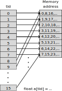
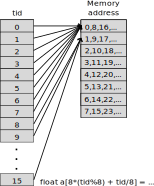

# Background: Matrix Transpose

Transposing a matrix is memory bound problem because it is essentially just
memory copy. However, a naive implementation of it on GPU will result badly
coalesced memory accesses: either the reads are not coalesceable or the writes
are not coalesceable.

In this exercise your task is to compare the execution times and the effective
bandwidth between a simple `copy` kernel, a `naive` transpose implementation,
and two more optimized versions using `shared memory` (with and without bank
conflicts). The time is measured using the `events` as shown in section
[Streams, events, and synchronization](../../docs/03-streams.md). The effective
bandwidth is computed as the ratio between the total memory read and written by
the kernel (`2 x Total size of the Matrix in Gbytes`) and the execution time in
seconds. 

## Copy kernel
The base line for our experiment is the simple copy kernel. 
```
__global__ void copy_kernel(float *in, float *out, int width, int height) {
  int x_index = blockIdx.x * tile_dim + threadIdx.x;
  int y_index = blockIdx.y * tile_dim + threadIdx.y;

  int index = y_index * width + x_index;

  out[index] = in[index];
}
```
This kernel is only reading the data from the input matrix to the output
matrix. No optimizations are needed except for minor tuning in the  number of
threads per block. All reads from and writes to the GPU memory are coalesced
and it is maximum bandwidth that one could achieve on a given machine in a
kernel.

## Naive transpose

This is the first transpose version where each the reads are done in a
coalesced way, but not the writing.
```

__global__ void transpose__naive_kernel(float *in, float *out, int width, int height) {
  int x_index = blockIdx.x * tile_dim + threadIdx.x;
  int y_index = blockIdx.y * tile_dim + threadIdx.y;

  int in_index = y_index * width + x_index;
  int out_index = x_index * height + y_index;

  out[out_index] = in[in_index];
}
```
The index `in_index` increases with `threadIdx.x`, two adjacent threads,
`threadIdx.x` and `threadIdx.x+1`, access elements near each other in the
global memory. This ensures coalesced reads. On the other hand the writing is
strided. Two adjacent threads write to location in memory far away from each
other by `height`.

## Transpose with shared memory

Shared Memory (SM) can be used in order to avoid the uncoalesced writing
mentioned above.

```
__global__ void transpose_SM_kernel(float *in, float *out, int width,
                                     int height) {
  __shared__ float tile[tile_dim][tile_dim];

  int x_tile_index = blockIdx.x * tile_dim;
  int y_tile_index = blockIdx.y * tile_dim;

  int in_index =
      (y_tile_index + threadIdx.y) * width + (x_tile_index + threadIdx.x);
  int out_index =
      (x_tile_index + threadIdx.y) * height + (y_tile_index + threadIdx.x);

  tile[threadIdx.y][threadIdx.x] = in[in_index];

  __syncthreads();

  out[out_index] = tile[threadIdx.x][threadIdx.y];
}
```

The shared memory is local to each CU with about 100 time lower latency than
the global memory. While there is an extra synchronization needed to ensure
that the data has been saved locally, the gain in switching from uncoalesced to
coalesced accesses outweighs the loss. 

## (Bonus:) Shared memory bank conflicts

### Background

In order to improve the parallel access to shared memory, the shared memory is
divided into banks. At each cycle, memory access can be made concurrently from each 
bank. If, however, more than one access attempt is made to the
same bank at the same time, a **bank conflict** occurs. In this case, hardware prevents the attempted concurrent accesses to the same bank by turning them into serial accesses. Thus, performance
is improved if threads within a warp are accessing different banks.

The figures below illustrate a case where there are 8 banks accessed by 16 threads

**Case 1: 2 bank conflicts (minimal here), whole access in 2 cycles**

{width=40%}

**Case 2: 8 bank conflicts, whole access in 8 cycles**

{width=40%}

### Transpose with shared memory and no bank conflicts

While the first access `tile[threadIdx.y][threadIdx.x] = in[in_index];` is free on bank
conflicts the second one `out[out_index] = tile[threadIdx.x][threadIdx.y];` is not.
The accesses of consecutive threads are 16 elements apart, and as there 32 banks 
in MI250x there are 32 banks, more accesses within a  wavefront end  up in the same banks
as in the case of consecutive "in" accesses.

The bank conflicts in this case can be solved in a very simple way. We pad the
shared matrix. Instead of `__shared__ float tile[tile_dim][tile_dim];` we use
`__shared__ float tile[tile_dim][tile_dim+1];`. Effectively this shifts the
data in the banks and hopefully won't create more banks conflicts than it
removes!

```
__global__ void transpose_SM_nobc_kernel(float *in, float *out, int width,
                                     int height) {
  __shared__ float tile[tile_dim][tile_dim+1];

  int x_tile_index = blockIdx.x * tile_dim;
  int y_tile_index = blockIdx.y * tile_dim;

  int in_index =
      (y_tile_index + threadIdx.y) * width + (x_tile_index + threadIdx.x);
  int out_index =
      (x_tile_index + threadIdx.y) * height + (y_tile_index + threadIdx.x);

  tile[threadIdx.y][threadIdx.x] = in[in_index];

  __syncthreads();

  out[out_index] = tile[threadIdx.x][threadIdx.y];
}
```

# Exercise

- Compile and execute the code and record bandwidths (MI250x GCD has
  theoretical memory bandwidth of 1600 GB/s).
- Profile the code with `rocprofv3` and measure 
  - read and write requests for memory buses TCP_TCC and TCC_EA.
  - how much GPU is stalled by LDS bank conflicts.
- Do above measurements explain increase in throughput?
